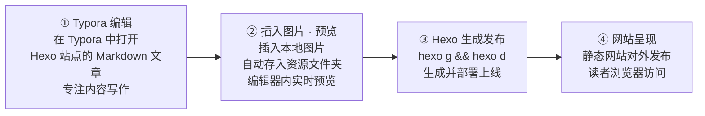

# hexo-image-link 

This plugin is designed for the **Hexo + Typora** workflow.

一个专门为 **Hexo + Typora** 工作流设计的Hexo插件。

## Why this plugin？ / 为什么开发这个插件？

如果你用 Hexo 管理自己的博客或者其他类型的站点，并且使用 Typora 作为日常的主力编辑器，那么你可能会遇到这样的问题：按照标准 Markdown 语法插入的图片，在使用 Typora 编辑时，图片能够正常显示，但在 Hexo 发布后，图片就会显示不出来。



虽然官方的 hexo-render-marked 插件也可以将  形式的图片转变为网站路径，但是这种写法在打开了 post_asset_folder 选项时，不支持在 Typora 中预览图片。同时我也尝试了其他类似功能的插件，比如 `hexo-asset-image` 等等，但是都存在一些问题，所以我开发了这个插件，希望能够帮助大家解决这个问题。

# Usage 使用方法

```sh
# Enter your hexo blog directory 进入你的 hexo 站点目录
$ npm install hexo-image-link --save
```

编辑 Hexo 配置文件，修改 `hexo-asset-folder: true`. 

```sh
$ hexo new 20200315-es-monitoring-guide
INFO  Created: ~/Projects/hexo-blog/blog/source/_posts/20200315-es-monitoring-guide.md
$ ls -lh source/_posts/
total 56
drwxr-xr-x@  9 shiqiang  staff   288B  3 15 10:28 ./
drwx------+ 32 shiqiang  staff   1.0K  3 14 07:52 ../
drwxr-xr-x@  2 shiqiang  staff    64B  3 15 10:28 20200315-es-monitoring-guide/
-rw-r--r--@  1 shiqiang  staff    76B  3 15 10:28 20200315-es-monitoring-guide.md
```

Use Typora edit Markdown file and insert image.

```markdown

```

Then generate public files.
```sh
$ hexo generate
```

# What the plugin do / 插件原理

When enabled hexo `post_asset_folder: true`, convert the markdown image path to asset_img syntax, to make the image display both in typora and hexo.

`` -> ``

在 Hexo 启用 `post_asset_folder: true` 选项后，将 Markdown 语法的图片路径转换为 asset_img 的方式，使图片能够在使用 Typora 编辑状态和 Hexo 预览发布时，文章中的图片都能正常显示。

# support img tag

When insert imgage in typora and set image scale, typora will transer `` pattern to ``.
This will cause the published page can't correctly display your image.
This feature will change `post_path/your_image.png` to full path and make your image display correctly.

# hexo-asset-image's problem

网上很多资料提示使用 `hexo-asset-image` 插件，但是在 `hexo 4.2.0` 环境下，生成的路径不对，如下：

```sh
update link as:-->/.cn//Screenshot-150-1-20200314081849804.png
update link as:-->/.cn//image-20200314080935503.png
```

Cause that old packages doen't work, i developed hexo-image-link, you can find more in my blog [Hexo博客写作与图片处理的经验](http://edulinks.cn/2020/03/14/20200314-write-hexo-with-typora/)

鉴于之前的插件不太好用，我开发了这款 hexo-image-link 插件，详细的使用方法，可以参考我的博客 [Hexo博客写作与图片处理的经验](http://edulinks.cn/2020/03/14/20200314-write-hexo-with-typora/)


# Release Note
* 2026-09-30    Modify readme, show more about my typora + hexo workflow
* 2024-02-21    Support img tag, if insert img tag by typora, you can view your image both on typora and published website
* 2022-12-13    Fix problem that unsupport path with space

# 参考资料
1. [hexo-asset-image](https://github.com/xcodebuild/hexo-asset-image)
2. [hexo-simple-image](https://github.com/Aragakiiii/hexo-simple-image)
